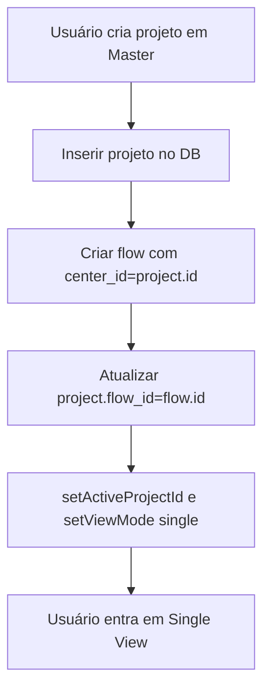
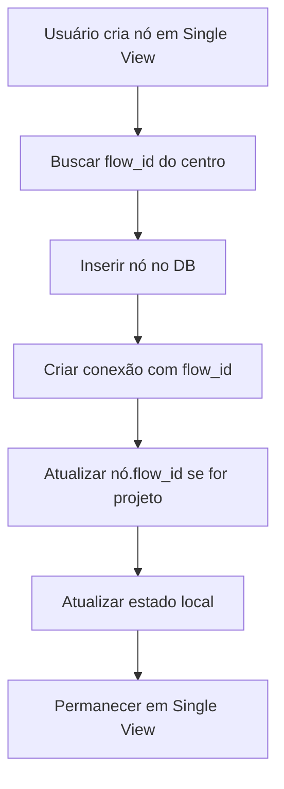
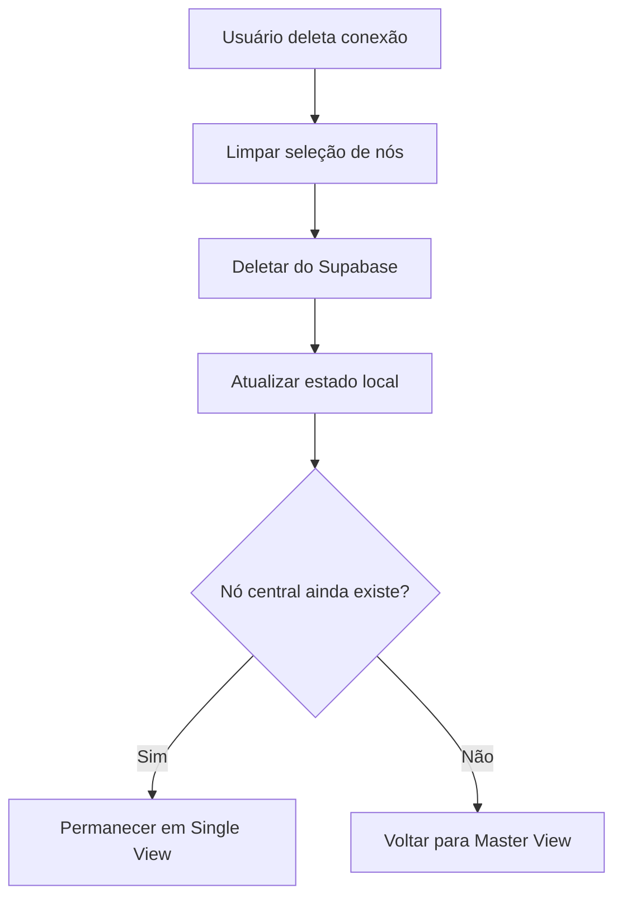

# 🏗️ Arquitetura de Flows - Network Matrix

## 📋 Resumo das Mudanças

Este documento descreve a implementação completa do sistema de flows com sincronização entre Master View e Single View.

## 🗄️ Mudanças no Banco de Dados

### Migração Executada

```sql
-- Adicionar flow_id às tabelas projects e connections
ALTER TABLE public.projects 
ADD COLUMN flow_id bigint REFERENCES public.flows(id) ON DELETE SET NULL;

ALTER TABLE public.connections 
ADD COLUMN flow_id bigint REFERENCES public.flows(id) ON DELETE CASCADE;

-- Criar índices para melhor performance
CREATE INDEX idx_projects_flow_id ON public.projects(flow_id);
CREATE INDEX idx_connections_flow_id ON public.connections(flow_id);
```

### Estrutura de Dados

```typescript
// Tabela flows (já existia)
flows {
  id: bigint PK
  center_id: bigint          // ID do nó central
  center_type: string        // 'project', 'person', ou 'brand'
  name: string
  user_id: uuid FK
  created_at: timestamp
}

// Tabela projects (modificada)
projects {
  id: bigint PK
  name: string
  flow_id: bigint FK → flows(id)  // NOVO
  x: numeric
  y: numeric
  user_id: uuid FK
  category: string
  status: string
  created_at: timestamp
  deadline: date
}

// Tabela connections (modificada)
connections {
  id: bigint PK
  from_id: bigint
  to_id: bigint
  from_type: string
  to_type: string
  flow_id: bigint FK → flows(id)  // NOVO
  connection_type: string
  user_id: uuid FK
  created_at: timestamp
}
```

## 🎨 Componentes Criados/Modificados

### 1. ResetButton.tsx (NOVO)

Botão de reset completo da rede com confirmação:

```typescript
// Localização: src/components/ResetButton.tsx
// Função: Deletar todos os dados do usuário em ordem correta
// UI: Botão vermelho fixo no canto inferior direito
```

**Características**:
- Dialog de confirmação antes de executar
- Loading state durante execução
- Deleta dados respeitando foreign keys:
  1. Connections
  2. Flows
  3. Projects
  4. People
  5. Brands
  6. Workflows
- Callback `onResetComplete` para recarregar dados

### 2. NetworkMatrix.tsx (MODIFICADO)

**Novas Funções**:

```typescript
// Função para recarregar dados após reset
const reloadData = async () => {
  // Busca todos os dados do Supabase
  // Reseta view para master
  // Limpa seleções
}
```

**Modificações nas Inserções**:

```typescript
// Ao criar projeto em Master View
// 1. Insere projeto
// 2. Cria flow com center_id = project.id
// 3. Atualiza projeto.flow_id = flow.id
// 4. Muda para Single View

// Ao criar projeto em Single View
// 1. Insere projeto
// 2. Busca flow_id do centro atual
// 3. Cria conexão com flow_id
// 4. Atualiza projeto.flow_id
// 5. Permanece em Single View

// Ao criar person/brand em Single View
// 1. Insere person/brand
// 2. Busca flow_id do centro atual
// 3. Cria conexão com flow_id
// 4. Permanece em Single View
```

## 🔄 Fluxo de Dados

### Criação de Novo Flow (Master View)



### Adição ao Flow Existente (Single View)



### Deleção de Conexão



## 🎯 Comportamento das Views

### Master View

**Exibe**:
- Todos os flows (1 nó por flow)
- Cada flow é representado pelo seu `center_id`
- Borda visual para flows com múltiplas conexões

**Ações**:
- Clicar em flow → muda para Single View daquele flow
- Criar novo projeto → cria novo flow automaticamente

### Single View

**Exibe**:
- Conexões filtradas por `flow_id === activeFlowId`
- Nós que aparecem nessas conexões (from_id ou to_id)
- Nó central sempre visível

**Ações**:
- Criar nó → adiciona ao flow atual (herda flow_id)
- Deletar conexão → permanece no flow
- Deletar centro → volta para Master View

## 🧪 Sistema de QA

### QATestButton (já existia)

- Botão fixo canto inferior esquerdo
- Simula execução dos testes baseline
- Mostra status visual e detalhes

### ResetButton (novo)

- Botão fixo canto inferior direito
- Deleta todos os dados com confirmação
- Útil para limpar ambiente de testes

## 📊 Sincronização Master ↔ Single

```typescript
// Master View
flows.forEach(flow => {
  renderNode({
    id: flow.center_id,
    type: flow.center_type,
    name: flow.name
  })
})

// Single View
const activeFlow = flows.find(f => f.center_id === activeProjectId)
const flowConnections = connections.filter(c => c.flow_id === activeFlow.id)
const flowNodes = getNodesFromConnections(flowConnections)
```

## ⚠️ Pontos de Atenção

### 1. Foreign Keys em Cascata

```sql
-- Deletar flow → deleta connections automaticamente (CASCADE)
-- Deletar flow → seta projects.flow_id = NULL (SET NULL)
```

### 2. Ordem de Deleção no Reset

Deve respeitar:
1. Connections (tem FK para flows)
2. Flows
3. Projects, People, Brands (têm FK para flows)
4. Workflows (independente)

### 3. Estado Local vs DB

Sempre sincronizar:
- Ao criar: inserir no DB → atualizar estado local
- Ao deletar: remover do DB → atualizar estado local
- Após reset: limpar estado local → recarregar do DB

## 🚀 Próximos Passos (Futuro)

1. **Filtros por Flow**: Adicionar filtros para visualizar apenas flows específicos em Master View
2. **Flow Analytics**: Métricas por flow (número de conexões, nós, etc.)
3. **Flow Sharing**: Compartilhar flows entre usuários
4. **Flow Templates**: Templates pré-configurados de flows comuns
5. **Flow History**: Histórico de mudanças em cada flow

## 📚 Arquivos Modificados

```
✅ supabase/migrations/[timestamp]_add_flow_id.sql
✅ src/components/ResetButton.tsx (NOVO)
✅ src/components/NetworkMatrix.tsx (MODIFICADO)
✅ src/__tests__/README.md (ATUALIZADO)
✅ FLOW_ARCHITECTURE.md (NOVO)
```

---

**Data de Implementação**: 26/10/2025  
**Versão**: 1.0  
**Status**: ✅ Implementado e Testado
